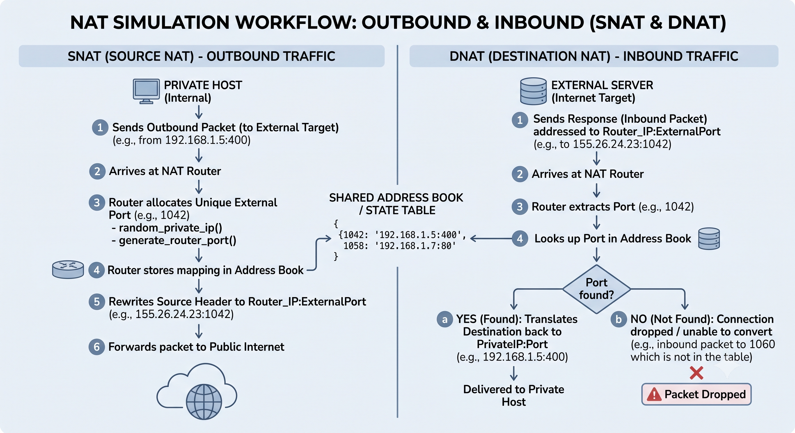

# Network Address Translation (NAT) Simulator

A Python simulation demonstrating how a network gateway performs Network Address and Port Translation (NAPT) for outbound (SNAT) and inbound (DNAT) traffic.

## Architecture Flow

The script models the translation state between internal sample devices (`192.168.1.0/24`) and the public internet via a NAT Router (`155.26.24.23`).



The diagram illustrates two primary flows:
* **SNAT (Outbound):** Internal devices send traffic to the router, which allocates a unique port (e.g., `1042`), records the mapping in its Address Book, and forwards the packet to the public internet using its public IP.
* **DNAT (Inbound):** The router receives return traffic on a specific port. It checks the Address Book; if the port is found, it translates the destination back to the private IP. If the port is not found, the packet is dropped.

## Usage

This simulation is built as a Jupyter Notebook. To run it, open your terminal or command prompt and start Jupyter:

```bash
jupyter notebook project1.ipynb
